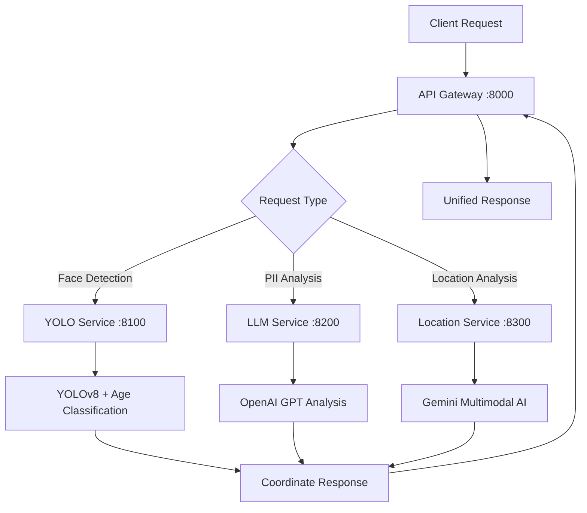

# TikTok AI Privacy Protection System

A microservices-based system for content privacy protection, built for the TikTok competition. The system detects and provides masking coordinates for faces, personally identifiable information (PII), and location-sensitive content in images.  

> Note: The cloud micro-service code is in the `main` brainch and the local mobile code is in the `mobile-app` branch.

- Hosted Swagger is here: `http://ec2-18-136-120-44.ap-southeast-1.compute.amazonaws.com:8000`. API Key is `IAMASECRET`
- Postman Collection for indivisual microservice available in `\docs`

## Architecture

The system consists of four containerized services:

1. **API Gateway** (`src/app.py`) - REST API with Flask and Swagger documentation
2. **YOLO Service** (`services/yolo/`) - Computer vision for face detection and object recognition
3. **LLM Service** (`services/llm/`) - OpenAI GPT-based PII detection in text
4. **Location Service** (`services/location/`) - Google Gemini-based location analysis

## Features

- **Face Detection**: Uses YOLOv8 and Haar Cascade classifiers to detect faces
- **Age Classification**: OpenCV DNN model to identify minors for selective protection
- **PII Detection**: OpenAI GPT analysis of OCR text to identify personal information
- **Location Analysis**: Google Gemini analysis for location-sensitive content
- **Object Detection**: YOLO-based detection of vehicles, signs, and other objects
- **Text Recognition**: EasyOCR for extracting text from images

## Technology Stack

### AI Models
- **YOLOv8n**: Object detection model
- **YOLOv8n-Face**: Face detection model  
- **OpenCV DNN**: Age classification model
- **OpenAI GPT**: Language model for PII analysis
- **Google Gemini**: Multimodal AI for location analysis
- **EasyOCR**: Text recognition

### Core Technologies
- **Python 3.9+**: Programming language
- **Flask + Flask-RESTX**: Web framework with API documentation
- **OpenCV**: Computer vision library
- **Ultralytics**: YOLO implementation
- **LangChain**: LLM integration framework
- **Docker**: Containerization

### Dependencies
```
# Computer Vision
ultralytics              # YOLO implementation
opencv-python-headless   # Computer vision operations
pillow                   # Image processing
easyocr                  # Text recognition

# AI Integration
langchain               # LLM framework
langchain-openai       # OpenAI integration
google-genai           # Gemini integration
pydantic               # Data validation

# Web Framework
flask==2.3.3           # Web framework
flask-restx==1.1.0     # API documentation
requests==2.31.0       # HTTP client
```

## Setup

### Prerequisites
- Docker and Docker Compose
- OpenAI API key
- Google Gemini API key (optional)

### Installation

1. Clone the repository:
   ```bash
   git clone https://github.com/FishPain/TikTok.git
   cd TikTok
   ```

2. Set up environment variables:
   ```bash
   cp .env.template .env
   # Edit .env file with your API keys
   ```

3. Start the services:
   ```bash
   ./start.sh
   # or manually: docker-compose up --build
   ```

4. Access the API:
   - API Gateway: http://localhost:8000
   - Swagger UI: http://localhost:8000/

## API Usage

All endpoints require API key authentication via `x-api-key` header.

### Face Detection
```bash
curl -X POST \
  -H "x-api-key: your_key" \
  -F "file=@image.jpg" \
  http://localhost:8000/api/mask/face
```

Response:
```json
{
  "mask": [
    {
      "coordinate": "(100.5, 200.8, 150.2, 250.9)",
      "reason": "visible face"
    }
  ]
}
```

### PII Detection
```bash
curl -X POST \
  -H "x-api-key: your_key" \
  -F "file=@image.jpg" \
  -F 'ocr_values=[{"text":"john@email.com","bbox":[100,200,300,220],"confidence":0.95}]' \
  http://localhost:8000/api/mask/pii
```

### Location Analysis
```bash
curl -X POST \
  -H "x-api-key: your_key" \
  -F "file=@image.jpg" \
  http://localhost:8000/api/mask/location
```

### Health Check
```bash
curl -H "x-api-key: your_key" http://localhost:8000/v1/health
```

## Project Structure

```
TikTok/
├── docker-compose.yml        # Service orchestration
├── Dockerfile               # API Gateway container
├── requirements.txt         # Gateway dependencies
├── start.sh                # Deployment script
├── src/
│   ├── app.py              # API Gateway
│   └── helper.py           # Service utilities
└── services/
    ├── yolo/               # Computer Vision Service
    │   ├── yolo.py         # YOLO implementation
    │   ├── Dockerfile      # Container definition
    │   ├── requirements.txt
    │   └── models/         # AI model files
    ├── llm/                # Language Model Service
    │   ├── pii.py          # PII detection
    │   ├── Dockerfile
    │   └── requirements.txt
    └── location/           # Location Service
        ├── location.py     # Location analysis
        ├── Dockerfile
        └── requirements.txt
```

### Service Communication Flow



## Development

### Service Communication
Services communicate via HTTP within Docker network:
- API Gateway → YOLO Service: `http://yolo-service:8100`
- API Gateway → LLM Service: `http://llm-service:8200`
- API Gateway → Location Service: `http://location-service:8300`

### Environment Variables
```bash
API_SECRET_KEY=your_secret_key
OPENAI_API_KEY=your_openai_key
GEMINI_API_KEY=your_gemini_key
YOLO_SERVICE_URL=http://yolo-service:8100
LLM_SERVICE_URL=http://llm-service:8200
LOCATION_SERVICE_URL=http://location-service:8300
```

### Common Commands
```bash
# View logs
docker-compose logs -f

# Restart service
docker-compose restart yolo-service

# Stop all services
docker-compose down

# Rebuild
docker-compose up --build
```

## Troubleshooting

### Common Issues

**Authentication Errors (401)**
- Check API key in request headers
- Verify API_SECRET_KEY environment variable

**Service Connection Issues**
- Ensure all services are running: `docker-compose ps`
- Check Docker network: `docker network ls`
- View service logs: `docker-compose logs [service-name]`

**Model Loading Issues**
- YOLO models download automatically on first run
- Check model files exist in `services/yolo/models/`
- Verify internet connection for model downloads

**Port Conflicts**
- Ensure ports 8000, 8100, 8200, 8300 are available
- Stop conflicting services or change ports in docker-compose.yml

#### Location Masking
```bash
curl -X POST -F "file=@image.jpg" http://localhost:8000/api/mask/location
```
Response format:
```json
{
  "data": [
    [50.0, 75.5, 180.3, 120.8],
    [250.2, 300.1, 400.6, 380.9]
  ]
}
```

#### PII Masking
```bash
curl -X POST \
  -F "file=@image.jpg" \
  -F 'ocr_values=[{"text": "john@email.com", "bbox": [100, 200, 300, 220], "confidence": 0.95}]' \
  http://localhost:8000/api/mask/pii
```
Response format:
```json
{
  "data": [
    [120.0, 200.5, 350.8, 230.2],
    [400.1, 450.3, 600.7, 480.9]
  ]
}
```

### Chat Completion
```bash
curl -X POST http://localhost:8000/v1/chat/completions \
  -H "Content-Type: application/json" \
  -d '{
    "model": "gpt-3.5-turbo",
    "messages": [{"role": "user", "content": "Hello!"}],
    "temperature": 0.7,
    "max_tokens": 150
  }'
```

## API Documentation

Once the services are running, you can access the interactive API documentation at:
- **Swagger UI**: http://localhost:8000/

## Service Details

### YOLO Service
- **Model**: YOLOv5s (small version for faster inference)
- **Input**: Image files (JPEG, PNG)
- **Output**: Object detections with bounding boxes and confidence scores
- **Confidence Threshold**: 0.5 (configurable)
- **Use Cases**: Face detection, location masking (signs, vehicles, buildings)

### OpenAI Service
- **Models**: All OpenAI models (gpt-3.5-turbo, gpt-4, etc.)
- **Input**: Chat messages in OpenAI format
- **Output**: Generated responses with usage statistics
- **Use Cases**: Chat completions, PII detection in OCR text

## Monitoring and Logging

- All services include structured logging
- Health check endpoints for monitoring
- Error handling with appropriate HTTP status codes
- Request/response logging for debugging

## Scaling and Performance

- Each service runs independently and can be scaled separately
- GPU support available for vision models (CUDA)
- Stateless design for horizontal scaling
- Docker networking for efficient inter-service communication

## Security Considerations

- API keys managed through environment variables
- Service isolation through Docker containers
- Internal network communication between services
- Input validation and error handling

## Development

### Adding New Models
1. Create a new service directory under `src/services/`
2. Implement Flask application with health check and prediction endpoints
3. Add Dockerfile and requirements.txt
4. Update docker-compose.yml
5. Add routes to API gateway

### Testing
Each service can be tested independently or through the API gateway.

## Troubleshooting

### Common Issues
1. **Model loading failures**: Check GPU/CPU compatibility and model downloads
2. **Service communication**: Verify Docker network configuration
3. **API key issues**: Ensure OpenAI API key is properly set in environment

### Logs
Check service logs:
```bash
docker compose logs yolo-service
docker compose logs openai-service
docker compose logs api-gateway
```

## License

This project is open source and available under the [MIT License](LICENSE).
